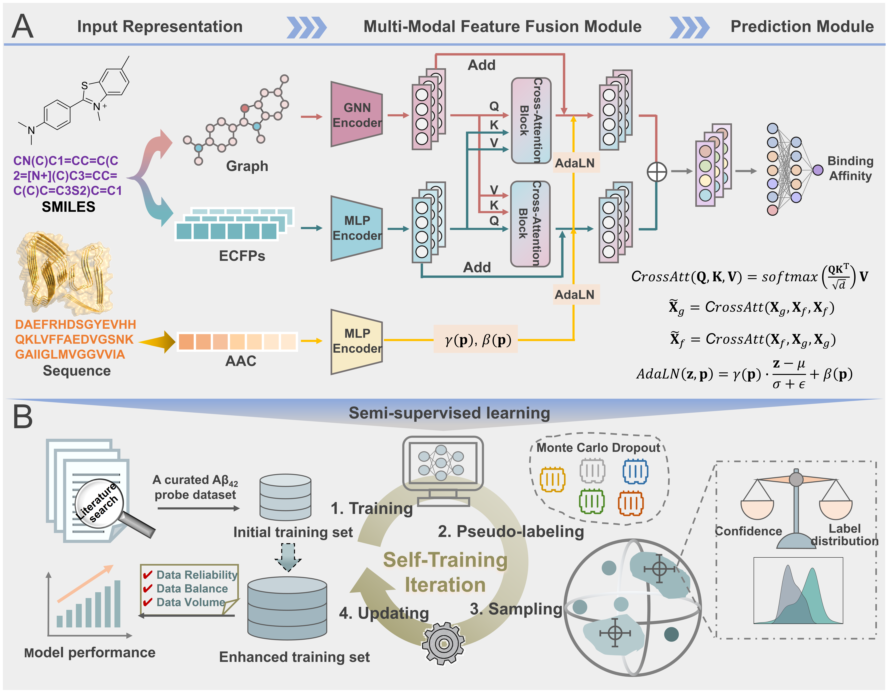

# SMDNet: a semi-supervised multi-modal deep learning network empowering low-data Aβ42 probe discovery

## Overview

SMDNet is an innovative semi-supervised multi-modal deep learning network designed to facilitate Aβ42-targeted probe discovery under low-data conditions. This framework addresses the critical challenge of limited labeled data in chemical probe development by integrating heterogeneous molecular features through advanced neural architectures and implementing an iterative self-training strategy.

## Model Architecture

*Overview of proposed SMDNet. (A) The model architecture with input representation module, multi-modal feature fusion module, and a prediction module. (B) The self-training pipeline: training, pseudo-labeling, sampling, and updating.


## Key Features

- **Multi-modal Integration**: Combines molecular graphs, fingerprints, and protein descriptors through cross-attention mechanisms
- **Protein-Guided Adaptation**: Employs adaptive layer normalization (AdaLN) conditioned on Aβ42 protein features
- **Semi-Supervised Learning**: Implements confidence and distribution-aware sampling for reliable pseudo-labeling
- **Interpretability**: Provides multi-level explanations from molecular to atomic resolution
- **Practical Utility**: Successfully guides the design and synthesis of novel fluorescent probes

## Architecture

SMDNet integrates several advanced deep learning components:

- **Graph Attention Networks (GAT)** for molecular graph processing
- **Cross-Attention Mechanisms** for multi-modal feature fusion
- **Adaptive Layer Normalization (AdaLN)** for protein-conditioned normalization
- **Monte Carlo Dropout** for uncertainty estimation
- **Confidence and Distribution-Aware** sampling

### Prerequisites

- Python 3.8+
- PyTorch 1.9+
- RDKit
- PyTorch Geometric

### Install Dependencies

```bash
git clone https://github.com/yourusername/SMDNet.git
cd SMDNet
pip install -r requirements.txt

Quick Start
1. Data Preparation
Prepare your data files in the data/ directory:
# Required data files
data/
├── data_train.csv    # Training data (ID, SMILES, pKd)
├── data_val.csv      # Validation data (ID, SMILES, pKd)
├── data_test.csv     # Test data (ID, SMILES, pKd)
└── BindingDB_data.csv # Screening library (SMILES)

2. Model Training
python scripts/run_training.py

3. Sampling
python scripts/run_screening.py

4. Molecular Interpretation
from src.explain import explain_single_molecule
from src.model import CrossAttGATNet_AdaLN
from config import Config
import torch

# Load model and explain a molecule
config = Config()
model = CrossAttGATNet_AdaLN(
    max_nodes=config.max_nodes,
    atom_feature_dim=config.atom_feature_dim,
    embedding_dim=config.embedding_dim,
    head=config.head,
    fps_dim=config.fps_dim,
    abeta_dim=config.abeta_dim,
    dropout=config.dropout
)
model.load_state_dict(torch.load('models/SMDNet.pth'))

result = explain_single_molecule(
    model=model,
    smiles='CCO',  # Your molecule SMILES
    abeta_feature=torch.tensor(compute_aac(config.abeta_sequence)),
    device=config.device
)


Project Structure
SMDNet/
├── config.py              # Configuration parameters
├── requirements.txt       # Python dependencies
├── README.md             # Project documentation
├── .gitignore           # Git ignore rules
├── src/                  # Source code
│   ├── __init__.py
│   ├── model.py          # Neural network architecture
│   ├── utils.py          # Data processing and molecular graphs
│   ├── train.py          # Training and evaluation functions
│   ├── explain.py        # Interpretability analysis
│   └── screening.py      # Virtual screening pipeline
├── scripts/              # Execution scripts
│   ├── run_training.py   # Training entry point
│   └── run_screening.py  # Screening entry point
└──── data/                 # Data directory


Model Architecture
SMDNet integrates several advanced deep learning components:
Graph Attention Networks (GAT): Process molecular graph structures
Cross-Attention Layers: Fuse molecular graph and fingerprint features
Adaptive Layer Normalization (AdaLN): Condition normalization on Aβ42 protein features
MC-Dropout: Estimate prediction uncertainty for semi-supervised learning
Confidence and Distribution-Aware Sampling: Select reliable pseudo-labeled molecules while alleviating label imbalance


Configuration
Key parameters in config.py:
# Model architecture
max_nodes = 75           # Maximum atoms per molecule
atom_feature_dim = 43    # Atom feature dimension  
fps_dim = 2048          # ECFP fingerprint dimension
embedding_dim = 128     # GAT embedding dimension

# Training parameters
epochs = 100
batch_size = 32
learning_rate = 0.0001
dropout = 0.1

# Screening parameters
candidate_percent = 0.4  # Initial candidate selection
num_samples = 100        # Final selected molecules
mc_dropout_samples = 10  # MC-Dropout iterations


Results and Applications
SMDNet has demonstrated:
Superior Performance: Outperforms baseline methods in predicting Aβ42 binding affinity
Effective Generalization: Validated on external test sets
Practical Utility: Successfully guided the design and synthesis of novel ThT-derived probes
Interpretable Predictions: Atom-level importance scores align with chemical expertise
The framework identified TA3 as a promising candidate with improved binding affinity and imaging specificity for Aβ42 aggregates.


